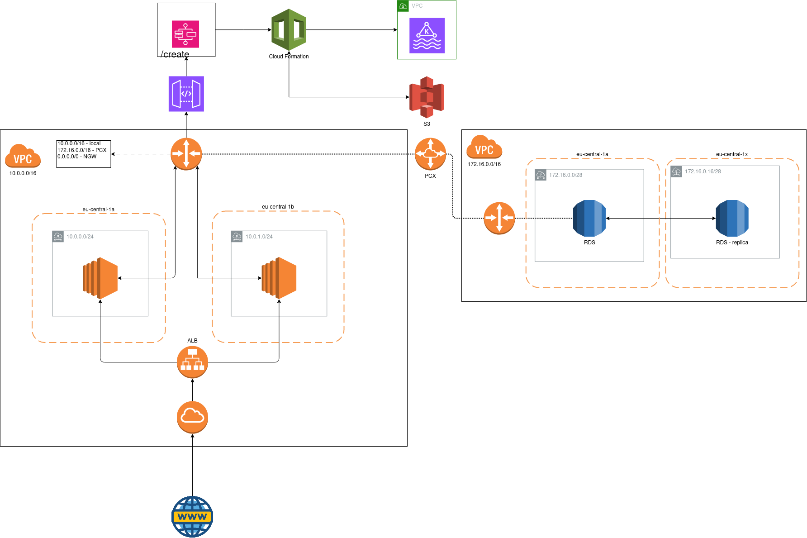

# ΣDAD (Σxtensible Dynamic Apache-Kafka Deployer)

ΣDAD aims to provide a platform for users to easily deploy, manage, and utilize AWS MSK clusters. By leveraging AWS Cloud's flexible infrastructure and automation capabilities, we can offer scalable, reliable, and cost-effective solutions.

## System Architecture Overview

### Front-end & Back-end

- A web interface would allow us to cover more platforms while remaining easily maintainable.
  - To achieve this we will have two Flask web servers on two different EC2’s.
  - We will also have a load balancer in the same VPC as the EC2 instances.
  - The flask website will have a login system with sessions, security etc.
  - After the user has outlined their configurations, the website will create a YAML playbook for Ansible and store each argument in the RDS database in case future configuration is needed.
  - We can use RDS as a database solution to store the users credentials and information (may change in the future).

### Infrastructure

- The main highlight of the project’s infrastructure will be the AWS Cloud.
  - **IAM**
    - Roles
      - we will be having different roles for both users and services (e.g. EC2, AWS MSK etc.).
    - Policies
      - every role will have specified policies depending on the actions the user or the service will have to do (read, write etc.).
  - **VPC**
    - Network segmentation
      - The two Flask webserver instances will be in a single VPC.
      - Each MSK cluster will be in a different VPC.
      - The Ansible and Terraform control nodes will also be in a different VPC.
      - The RDS will be in a separate VPC.
  - **S3**
    - will be used to store the CloudTrail log files.
    - AWS MSK user configurations.
  - **EC2**
    - Terraform control node.
    - Our Ansible control node.
    - 2 webservers.
    - AWS MSK works with clusters which are full with ec2 instances. And the instance type we are going to use is t3.small.
  - **Cloud[Trail, Watch]**
    - CloudTrail will check for specific important events and will save log files in a S3 bucket for monitoring.
    - CloudWatch will monitor some metrics provided to it by the MSK like CPU and RAM usage and put them in a dashboard which will be accessible by the user via link.
  - **AWS MSK: for data streams**
    - will be configured depending on the information given to us by the user and will be used to create data streams.
    - each broker will be placed in different availability zones.
  - **AWS Lambda: for data transfer**
    - Data transfer.
  - **Ansible**
    - will be used to manage the AWS MSK. It will work with the data provided by Lambda and use it to create data channel using AWS MSK.
  - **Terraform**
    - will be used to create and destroy the AWS MSK services.

### Missing concepts

- Docker/ECS
- VPN between the On-Premises server and the Cloud environment.

## Process Overview

### Create

- User input/create from the website.
- L1 triggered → Terraform node creates MSK.
- L2 triggered → Gets MSK data → sends to S3 <userid>/.
- L3 triggered on S3 folder creation → INSERTS address in RDS.

### Update

- User input/update.
- L4 triggered → sends S3 user config data to Ansible node → executes ansible cmd.
- L5 triggered on Ansible playbook completion → refresh Terraform data.

### Delete

- User input/delete.
- L6 triggered → Terraform destroy user MSK.

## Network Diagram

## Cost Estimation

### MSK

- 88.70 USD/month ( 1,064.40 USD/year )
  - 2 brokers: t3.small.
  - 50 GB storage space.

### EC2, S3, Lambda

- Free tier.

### Cloud[ Watch, Trail ]

- To be calculated.

### VPC

- 47.60 USD/month per VPC with a Load Balancer.
  - Gateway Load Balancer: 5 GB/hour.

## Additional technical documentation

[Terraform Conventions](./docs/terraform_conventions.md)
